<div align="center">

<picture>
  <source media="(prefers-color-scheme: dark)" srcset="assets/onefinance_lockup_mac_dark.png">
  
</picture>

**A local-first, fully encrypted personal finance manager for your desktop.**

[](https://github.com/HarshPanchal01/OneFinance/actions/workflows/ci.yml)
[](https://github.com/HarshPanchal01/OneFinance/releases/latest)
[](LICENSE)
-lightgrey)

</div>

---

OneFinance keeps your entire financial life — accounts, transactions, budgets, goals, investments — in a single SQLite database on **your** machine, encrypted at rest with a master password. There are no accounts, no cloud, no telemetry. The only network traffic the app ever makes is fetching market quotes for the investments you choose to track.

## Table of Contents

- [Features](#features)
  - [Dashboard](#dashboard)
  - [Transactions](#transactions)
  - [Budgets](#budgets)
  - [Savings Goals](#savings-goals)
  - [Schedules & Payment Reminders](#schedules--payment-reminders)
  - [Investments](#investments)
  - [Insights](#insights)
  - [Financial Calculators](#financial-calculators)
  - [Auto-Categorization Rules](#auto-categorization-rules)
  - [Security](#security)
  - [Encrypted Backups & Export/Import](#encrypted-backups--exportimport)
  - [Localization](#localization)
  - [Command Palette & Keyboard Shortcuts](#command-palette--keyboard-shortcuts)
  - [Themes & Privacy Mode](#themes--privacy-mode)
- [Privacy: Local-First by Design](#privacy-local-first-by-design)
- [Installation](#installation)
- [Development](#development)
- [Contributing](#contributing)
- [Security Policy](#security-policy)
- [License](#license)

## Features

### Dashboard

A one-screen overview of your money: income, expenses, and cash-flow KPIs with period-over-period deltas, a net-worth hero chart over your full history, and detail widgets for recent transactions, top spending (budget-aware, with your savings goals alongside), upcoming bills, and an investment watchlist. Every widget clicks through to the underlying data. A Customize panel lets you show, hide, and reorder widgets to taste.

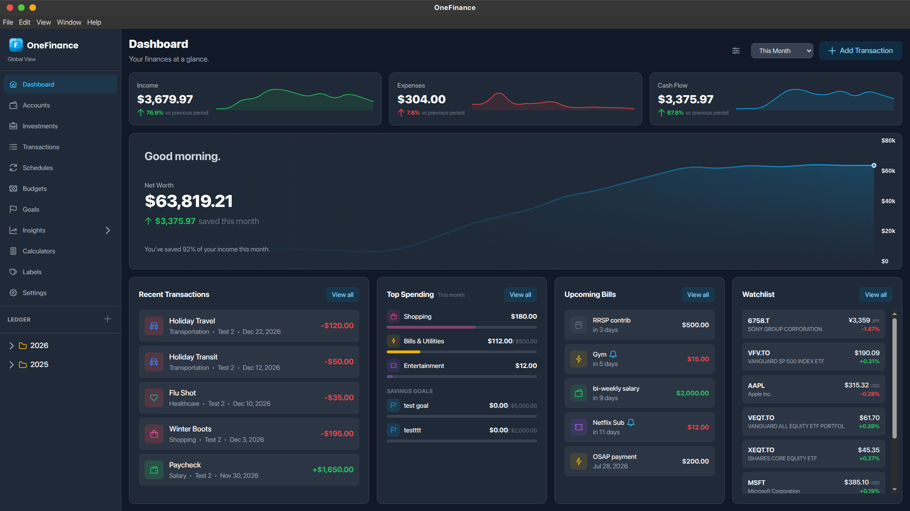

### Transactions

Log income, expenses, and transfers across all your accounts, with powerful filtering by label, account, date, amount, and type. Multi-select transactions for bulk delete or bulk category/account reassignment. Amount fields double as inline calculators — type `120 / 3 + 5.99` and it evaluates in place.

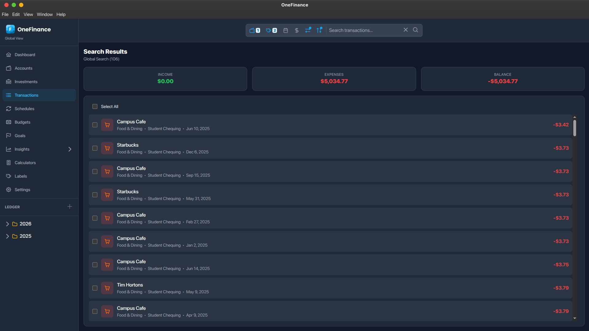

### Budgets

Set a monthly spending limit per category and track the current month against it: progress bars, pace indicator, days left, and a clear over-budget flag. Budgeted categories surface directly in the dashboard's spending widget so you always know where you stand.

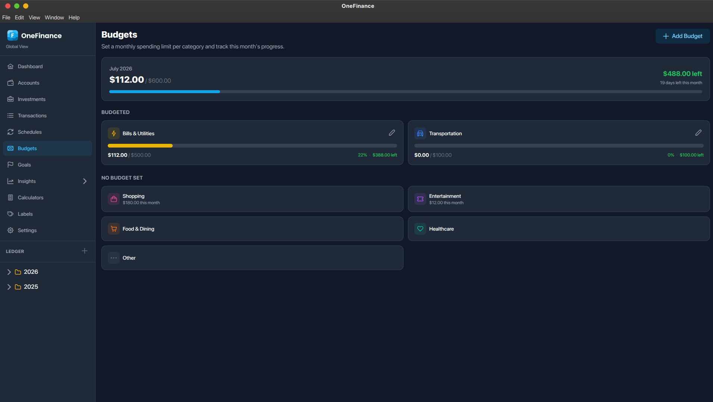

### Savings Goals

Define a target amount and optional deadline per goal. Progress tracks either a linked account's live balance or manual contributions, and a linear on-pace projection tells you the required monthly saving and whether you're on track to make the date.

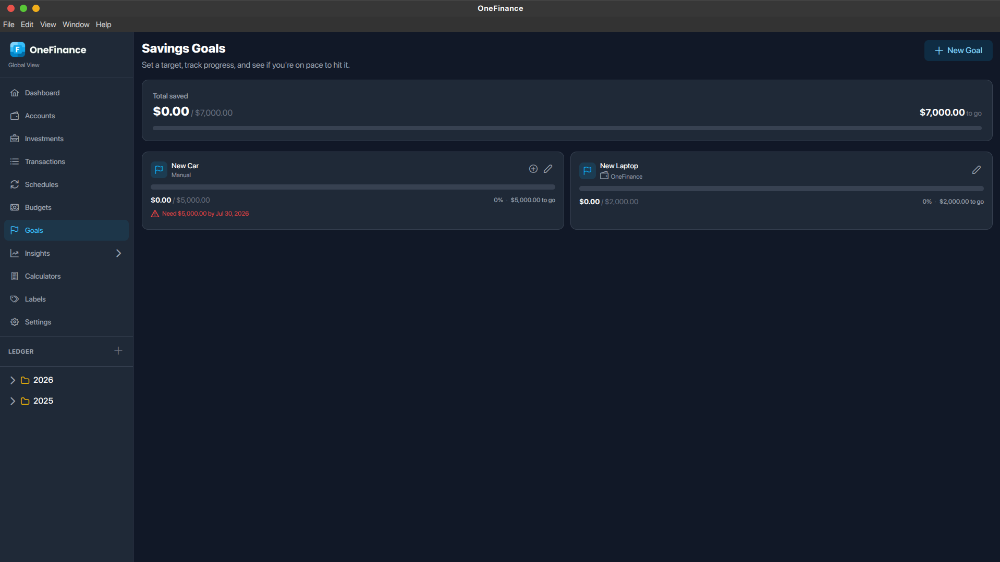

### Schedules & Payment Reminders

Recurring transactions (weekly, bi-weekly, monthly, yearly) post themselves automatically — rent, salary, subscriptions. Each schedule can fire a native desktop notification a configurable number of days before it's due, so bills never surprise you. Optional tray and start-on-login settings keep OneFinance running in the background, so schedules post and reminders fire even with the window closed.

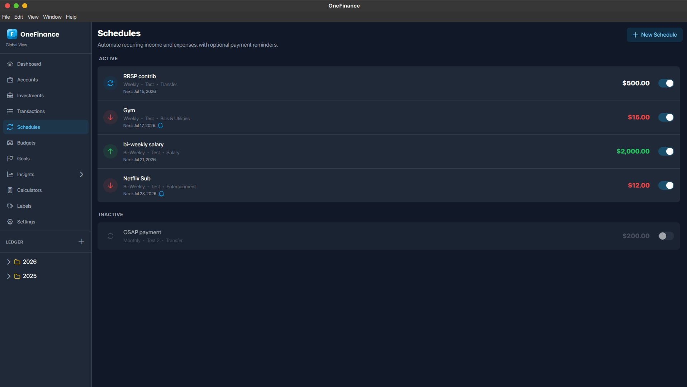

### Investments

Track portfolios of stocks, ETFs, mutual funds, and crypto with live quotes. Holdings quote in their native currency and convert automatically to yours, including trade-date exchange rates for accurate cost basis. Dividends are captured automatically from market data (or entered manually) and credited to your cash. Per-holding price alerts notify you when a position moves past your daily, weekly, or monthly threshold. Performance is measured with the Modified Dietz method so deposits and withdrawals don't distort returns.

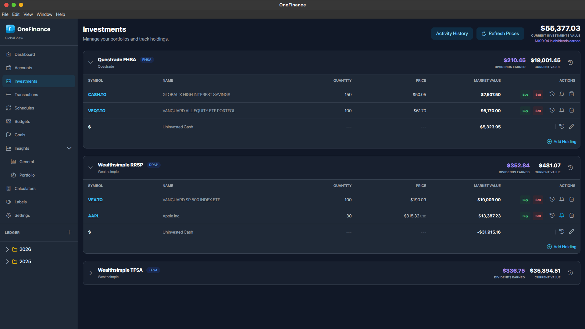

### Insights

Visualize where your money goes: cash-flow and net-worth trends, expense breakdowns by category, and a GitHub-style spending calendar heatmap that makes heavy-spend days obvious at a glance. A separate Investment Performance view benchmarks your portfolio over any period. Every chart clicks through to the matching filtered transactions.

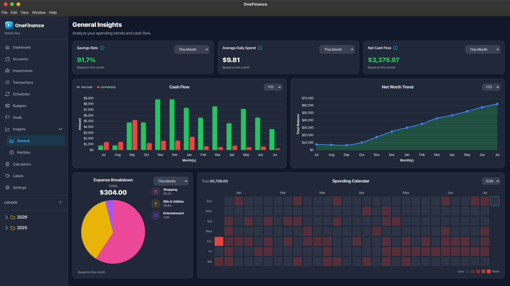

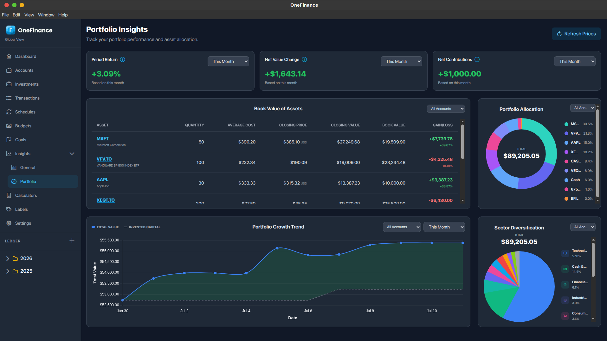

### Financial Calculators

Built-in compound interest, loan/mortgage amortization (with accelerated-payment comparison), and debt payoff planning (avalanche vs. snowball) — all client-side, nothing saved, safe for hypotheticals.

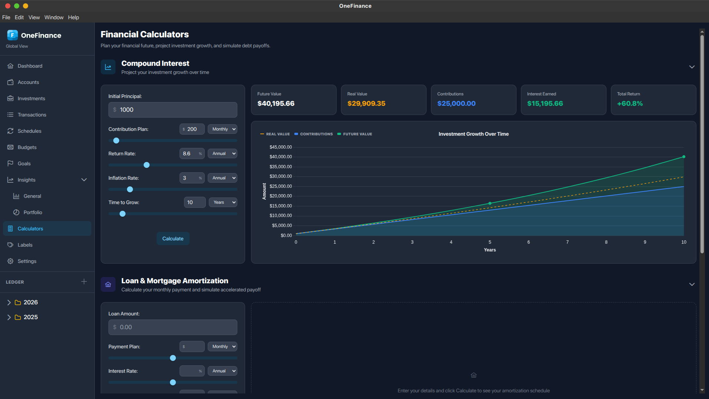

### Auto-Categorization Rules

Teach OneFinance your merchants once: "title contains *X* → category *Y*" rules pre-fill the category when you enter a matching transaction. Rules are ordered by priority, toggleable, and always overridable — a suggestion never fights your explicit choice.

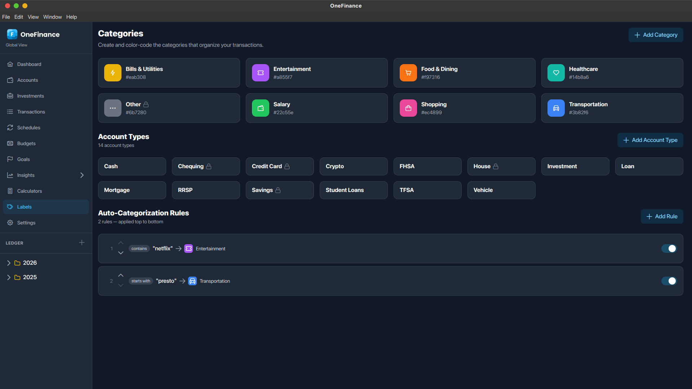

### Security

Your database is encrypted at rest with **SQLCipher**, keyed by a master password that never touches disk. The app locks automatically after a configurable idle period, on OS sleep/screen lock, or instantly with `Ctrl+Shift+L`. An optional stay-unlocked policy (15 minutes up to 1 week) stores the key in your **operating system's keychain** — never in plaintext — so you can skip re-typing on trusted machines. There is deliberately no password recovery: nobody, including us, can read your data without the password.

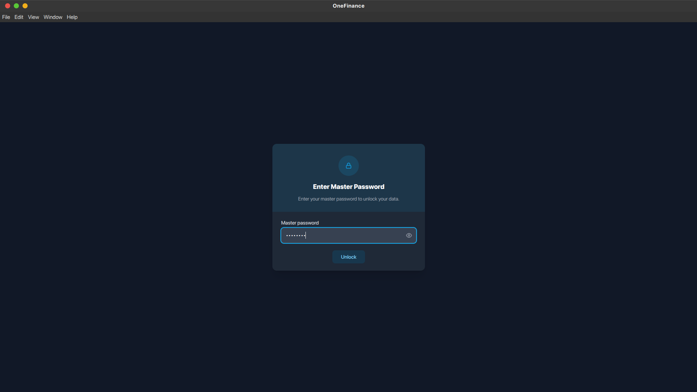

### Encrypted Backups & Export/Import

Automatic daily or weekly backups to a folder you choose, plus one-click manual backups — all encrypted with your master password (AES-256-GCM), with automatic rotation of old backup files. Export and import round-trip your complete dataset, and pre-2.0 plaintext exports still import for a smooth upgrade path.

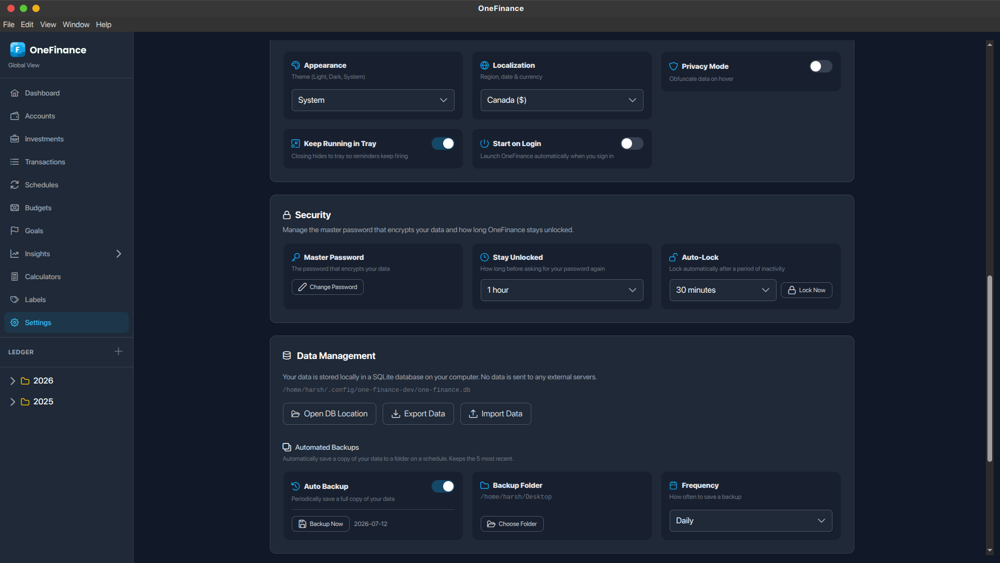

### Localization

Pick your region once and the whole app follows: date format, number separators, and currency symbol, consistently across every view, chart, and desktop notification.

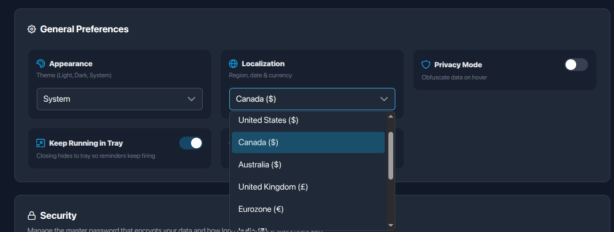

### Command Palette & Keyboard Shortcuts

`Ctrl+K` opens a fuzzy-searchable palette covering every view and common actions (new transaction, toggle privacy, lock). Every shortcut is remappable in Settings, with OS-aware bindings (`⌘` on macOS, `Ctrl` elsewhere) and conflict detection.

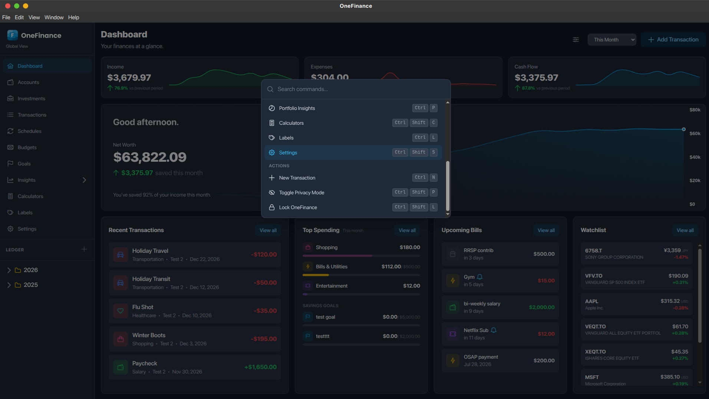

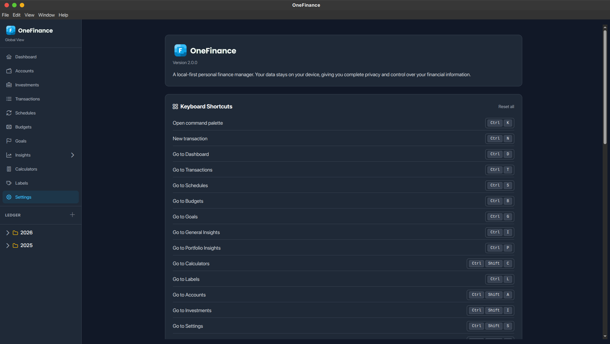

### Themes & Privacy Mode

Light and dark themes, applied consistently across every view, chart, and control — pick one or follow your system. Every screenshot above shows the dark theme; here's the same dashboard in light mode:

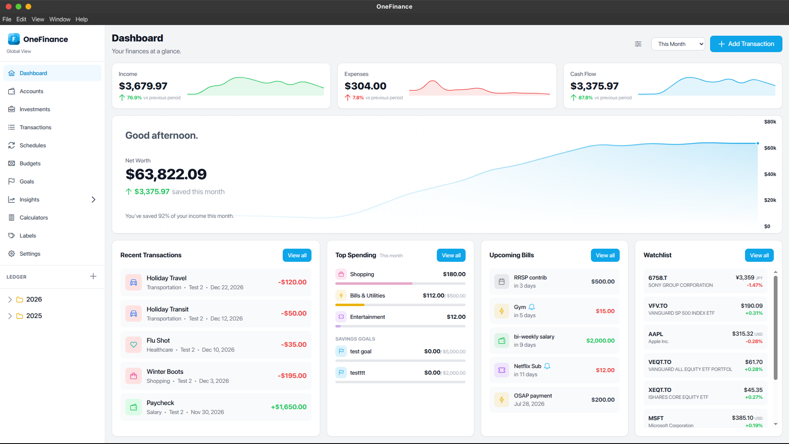

And a privacy mode blurs amounts for over-the-shoulder safety:

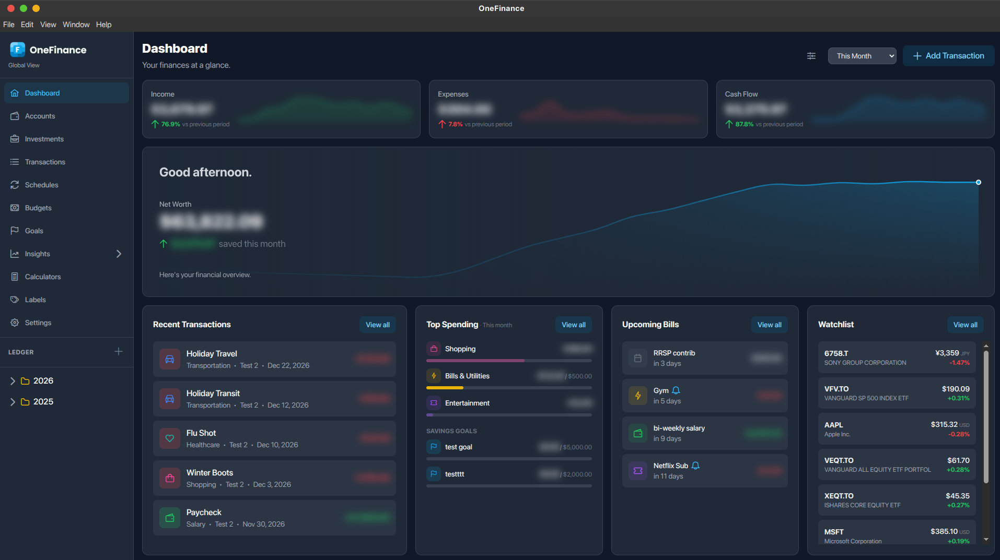

## Privacy: Local-First by Design

- **All data stays on your device**, in one SQLCipher-encrypted SQLite file.
- **No account, no sign-up, no cloud sync, no telemetry.** The app is fully functional offline.
- **The only outbound network calls** fetch market quotes and FX rates (Yahoo Finance) for investments you track — and only if you use the Investments feature.
- **Backups and exports are encrypted** with the same master password as the database.

## Installation

Download the latest version from the [Releases](https://github.com/HarshPanchal01/OneFinance/releases) page.

| OS | Install |
|---|---|
| **Windows** | Download and run the `.exe` installer. |
| **Linux** | Download the `.AppImage`, make it executable (`chmod +x`), and run it. |
| **macOS** | No prebuilt binaries — clone the repository and [build from source](#development) (`npm run dist:mac`). |

## Development

### Prerequisites

- **Node.js** v24+
- **npm** v11+

### Setup

```bash
git clone https://github.com/HarshPanchal01/OneFinance.git
cd OneFinance
npm install
npm run dev   # Vite dev server + Electron with hot-reload
```

### Scripts

| Command | Description |
|---|---|
| `npm run dev` | Start the app in development mode (hot-reload) |
| `npm run build` | Type-check, build, and package with Electron Builder |
| `npm run typecheck` | TypeScript type-checking (`vue-tsc`) |
| `npm run lint` | ESLint with auto-fix |
| `npm run lint:check` | ESLint, check only (what CI runs) |
| `npm test` | Unit tests (Vitest) |
| `npm run dist:win` / `dist:linux` / `dist:mac` | Build platform installers into `release/` |

## Contributing

Contributions are welcome! See [CONTRIBUTING.md](CONTRIBUTING.md) for the architecture overview, coding conventions, and pull-request workflow, and the [Code of Conduct](CODE_OF_CONDUCT.md) for community guidelines.

## Security Policy

Found a vulnerability? Please report it privately — see [SECURITY.md](SECURITY.md).

## License

Distributed under the MIT License. See [`LICENSE`](LICENSE) for more information.
